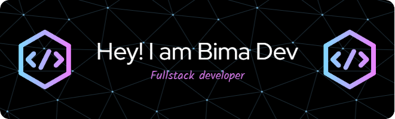

  
  
  

    
    
    
  

  

  

  ### Full Stack Developer | Educator | Tech Innovator | Lifelong Learner
   <!-- Custom banner here -->

---

### 👋 Welcome to My Code Universe!
Hi, I'm **Bima Jovanta** — a passionate **Full Stack Developer** and **Educator** from Indonesia.  
I love blending **technology, design, and creativity** to build clean, scalable, and user-centered web applications.

I believe code isn’t just about solving problems — it’s about **creating impact**.  
Let’s build something awesome together 🚀

---

  

---

## 👨‍💻 About Me
- 👨‍🏫 Educator and developer passionate about empowering others through technology.  
- 💡 Exploring **AI integration**, **automation tools**, and **web innovation**.  
- 🧠 Always learning, always building — one byte at a time.  
- 📬 Reach me on Instagram: 

---

## 🧩 Tech Stack & Tools
**Front-End:** React, Next.js, TailwindCSS, Bootstrap, HTML5, CSS3  
**Back-End:** Node.js, Express.js, Laravel  
**Database:** MySQL, PostgreSQL, Supabase  
**Languages:** TypeScript, JavaScript, Python  
**Dev Tools:** Git, VS Code, Prisma, Vercel, Docker  

  
  
  
  
  
  
  
  
  
  
  
  
  

---

## 🌐 Highlighted Works
### 🔹 [Intellis-AI](https://github.com/bimadevs/Intellis-Ai)
> An AI-powered code assistant that helps developers generate, explain, and debug code in real-time using OpenAI API.

### 🔹 [MyWeb](https://github.com/bimadevs/myweb)
> Personal portfolio website built with **Next.js 14 + TailwindCSS**, showcasing projects and contact links.

### 🔹 [Image-to-Code](https://github.com/bimadevs/image-to-code)
> Converts design images into responsive HTML/CSS — turning creativity into functional code.

### 🔹 [Bubble Game](https://github.com/bimadevs/bubble-game)
> A fun JavaScript-based web game made to explore DOM manipulation and interactivity.

---

## 📊 GitHub Stats

  
  

---

## 🏆 GitHub Achievements

  

---

## 📈 Activity Graph

  

---

## 🤝 Connect With Me
- 🌐 Website: [bimadev.xyz](https://bimadev.xyz)  
- 💼 Instagram: [biimaa_jo](https://instagram.com/biimaa_jo)  
- 📧 Email: **bimaj0206@gmail.com**

---

## 🧠 Interests
🏷️ Full Stack Development · AI Tools · Open Source · EdTech · Automation · UI/UX Design

---

## 🎮 When I'm Not Coding
- Experimenting with new AI or DevTools  
- Designing futuristic UI mockups  
- Watching sci-fi movies & learning new tech  

---

## 💡 Quote to Live By
> “Code is like humor. When you have to explain it, it’s bad.” — *Cory House*

---

⭐ **“Always learning, always building — one byte at a time.”** 🚀
